# EscaLeads — Visual Architecture & Audit

A comprehensive **graphical** walkthrough of the EscaLeads codebase. Every block, arrow, and box below is a Mermaid diagram — GitHub renders them natively, so this file *is* the visualization. Pair this with `ARCHITECTURE.md` (text reference) and `CLAUDE.md` (the AI contributor contract).

> Scroll the table of contents below or read top-to-bottom — each section is self-contained and can be read in isolation.

## Table of contents

1. [System context (who talks to what)](#1-system-context)
2. [Tech stack — layered view](#2-tech-stack)
3. [Repository layout](#3-repository-layout)
4. [Routing map (every URL)](#4-routing-map)
5. [Database — ER + RLS](#5-database--er--rls)
6. [API surface](#6-api-surface)
7. [Request flows (sequence diagrams)](#7-request-flows)
8. [Authentication & security (layered defense)](#8-authentication--security)
9. [Data fetching strategies (which page is which)](#9-data-fetching-strategies)
10. [Sanitization pipeline](#10-sanitization-pipeline)
11. [Styling architecture](#11-styling-architecture)
12. [Build & deploy pipeline](#12-build--deploy-pipeline)
13. [SEO audit findings](#13-seo-audit-findings)

---

## 1. System context

The actors, the app, and every external system it touches. C4-style overview.

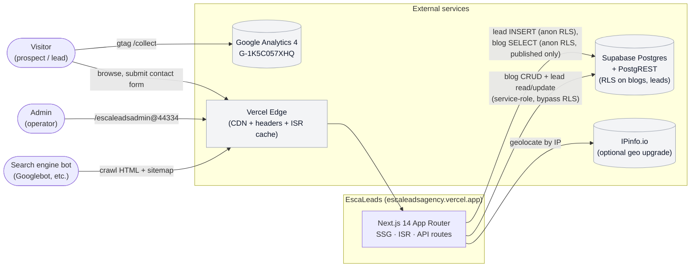

---

## 2. Tech stack

Pinned versions and intentional choices, from runtime to language. **No Tailwind, no styled-components, no Edge runtime for data routes.**

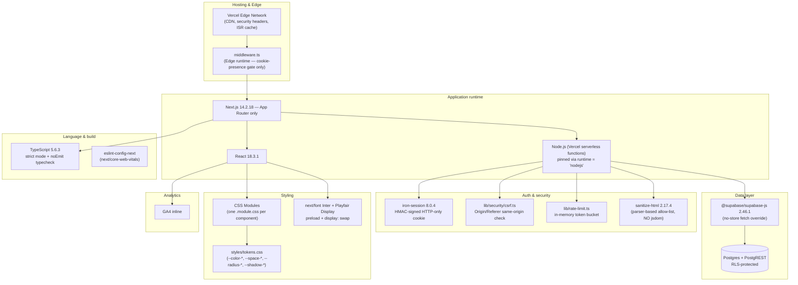

---

## 3. Repository layout

```
.
├── app/                                   Next.js App Router
│   ├── layout.tsx                         root shell, GA4 bootstrap, Org+WebSite JSON-LD
│   ├── page.tsx                           / homepage (stacks 6 sections, revalidate 3600)
│   ├── error.tsx / not-found.tsx / loading.tsx
│   ├── sitemap.ts / robots.ts             dynamic at build, includes published blog slugs
│   ├── services|how-it-works|our-work|contact/page.tsx
│   │
│   ├── blogs/
│   │   ├── layout.tsx                     {children} + {modal} parallel slot wrapper
│   │   ├── page.tsx                       /blogs listing (ISR 60s)
│   │   ├── BlogModalDialog.tsx            client overlay (scrim · ESC · scroll lock)
│   │   ├── BlogModalDialog.module.css
│   │   ├── [slug]/page.tsx                /blogs/<slug> SEO page (SSG + ISR, runtime=nodejs)
│   │   └── @modal/(.)[slug]/page.tsx      intercepting modal route (client-side nav only)
│   │
│   ├── api/
│   │   ├── leads/route.ts                 POST public — rate-limit, sanitize, schema-tolerant insert
│   │   └── admin/
│   │       ├── login/route.ts             iron-session login, timing-safe compare
│   │       ├── logout/route.ts
│   │       ├── blogs/route.ts             GET, POST (withAdminGuard)
│   │       ├── blogs/[id]/route.ts        GET, PUT, DELETE (withAdminGuard + safeRevalidate)
│   │       ├── leads/route.ts             GET
│   │       ├── leads/[id]/route.ts        PATCH (mark read), DELETE
│   │       ├── leads/export/route.ts      CSV download
│   │       └── diagnostics/route.ts       env + schema + CRUD self-test
│   │
│   └── escaleadsadmin@44334/              hidden admin (literal '@' is a path segment)
│       ├── layout.tsx                     async — checks session, mounts AdminSidebar shell
│       ├── page.tsx                       Login (logged-out) OR Dashboard (logged-in)
│       ├── AdminSidebar.tsx               persistent left nav (never remounts on navigation)
│       ├── LoginForm.tsx
│       ├── admin.module.css               admin-LOCAL palette (no bleed to public site)
│       ├── blogs/page.tsx · new/page.tsx · [id]/edit/page.tsx · BlogEditor.tsx
│       ├── leads/page.tsx · LeadRow.tsx · ExportButton.tsx
│       └── diagnostics/page.tsx · DiagnosticsRunner.tsx
│
├── components/
│   ├── navbar/Navbar.tsx                  expand-on-click navbar, bails on admin paths
│   └── analytics/GoogleAnalytics.tsx      manual SPA pageview tracker
│
├── sections/                              homepage section components
│   ├── home/Home.tsx + HeroActions.tsx    hero (server) + CTA buttons (client)
│   ├── services / how-it-works / our-work statically populated from lib/content/static.ts
│   ├── blogs-preview/BlogsPreview.tsx     async server — reads Supabase
│   └── contact/Contact.tsx                client form, posts /api/leads
│
├── lib/                                   non-React modules
│   ├── supabase/server.ts                 anon + service clients (both force cache: 'no-store')
│   ├── supabase/types.ts                  Blog · Lead · BlogInput
│   ├── auth/session.ts                    iron-session helpers (server-only)
│   ├── auth/cookie.ts                     cookie-name constant (Edge-safe)
│   ├── security/csrf.ts                   assertSameOrigin
│   ├── content/static.ts                  hardcoded services / projects / steps
│   ├── content/blogs.ts                   public reads (error-tolerant) + admin reads (throw)
│   ├── admin-handler.ts                   withAdminGuard — CSRF → rate → auth → handler → catch
│   ├── client-info.ts                     IP + geo from x-vercel-ip-* + IPinfo upgrade
│   ├── rate-limit.ts                      in-memory token bucket
│   ├── sanitize.ts                        plain-text sanitizer (regex, NO DOMPurify)
│   ├── sanitize-html.ts                   rich-HTML sanitizer (sanitize-html package, no jsdom)
│   ├── text-to-html.ts                    plain text → <p>/<br>/<a> for blog editor
│   └── format.ts                          formatDate / formatDateTime (Intl)
│
├── styles/
│   ├── index.css                          imports the three below
│   ├── reset.css
│   ├── tokens.css                         FROZEN — design tokens referenced everywhere
│   └── global.css                         .section · .container · .eyebrow · .sectionTitle
│
├── middleware.ts                          FROZEN — admin URL gate (Edge-safe)
├── next.config.mjs                        FROZEN — CSP, HSTS, image config, security headers
├── supabase/schema.sql                    single source of truth for DB schema + RLS
└── .env.local.example                     env var template
```

---

## 4. Routing map

Every URL the app exposes, color-coded by type. ƒ = serverless function, ● = SSG with revalidate, ○ = static, 🔒 = auth-gated.

```mermaid
flowchart TD
    Root[/"/"/]:::ssg
    Root --> Home["○ / — homepage<br/>revalidate 3600"]
    Root --> Services["○ /services"]
    Root --> HowItWorks["○ /how-it-works"]
    Root --> OurWork["○ /our-work"]
    Root --> Contact["○ /contact"]
    Root --> Sitemap["ƒ /sitemap.xml"]
    Root --> Robots["ƒ /robots.txt"]
    Root --> BlogList["○ /blogs<br/>ISR 60s"]
    BlogList --> BlogDetail["● /blogs/[slug]<br/>SSG + ISR 60s, runtime=nodejs<br/>Article + Breadcrumb JSON-LD"]
    BlogList -. "client-side nav<br/>(intercept)" .-> ModalRoute["ƒ /blogs/@modal/(.)[slug]<br/>Modal overlay"]

    Root --> Admin{{"🔒 /escaleadsadmin@44334"}}:::admin
    Admin --> AdminRoot["ƒ / (login OR dashboard)"]
    Admin --> AdminBlogList["ƒ /blogs"]
    AdminBlogList --> AdminBlogNew["ƒ /blogs/new"]
    AdminBlogList --> AdminBlogEdit["ƒ /blogs/[id]/edit"]
    Admin --> AdminLeads["ƒ /leads"]
    Admin --> AdminDiag["ƒ /diagnostics"]

    Root --> APIs[/"/api"/]:::api
    APIs --> APILeads["ƒ POST /api/leads — public<br/>(rate-limit, sanitize, anon-INSERT)"]
    APIs --> APIAdminPub["ƒ POST /api/admin/login<br/>ƒ POST /api/admin/logout"]
    APIs --> APIAdminBlogs["ƒ /api/admin/blogs · /:id<br/>GET, POST, PUT, DELETE 🔒"]
    APIs --> APIAdminLeads["ƒ /api/admin/leads · /:id · /export<br/>GET, PATCH, DELETE 🔒"]
    APIs --> APIDiag["ƒ /api/admin/diagnostics 🔒"]

    classDef ssg fill:#dcfce7,stroke:#16a34a;
    classDef admin fill:#fef3c7,stroke:#d97706;
    classDef api fill:#dbeafe,stroke:#2563eb;
```

---

## 5. Database — ER + RLS

Two tables in the `public` schema. RLS is enabled on both; service-role bypasses; anon is tightly scoped.

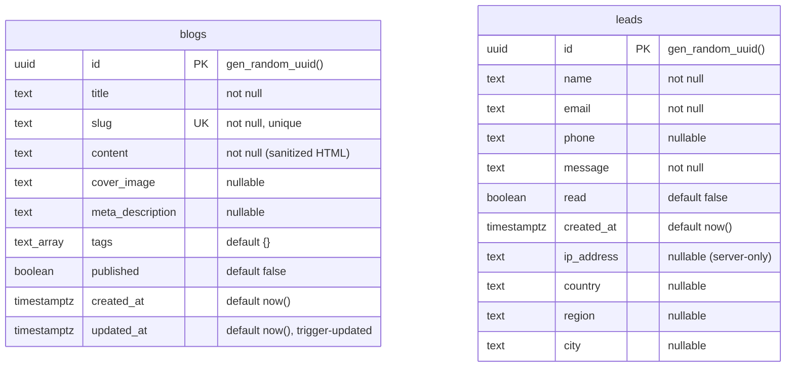

### Row-Level Security policies

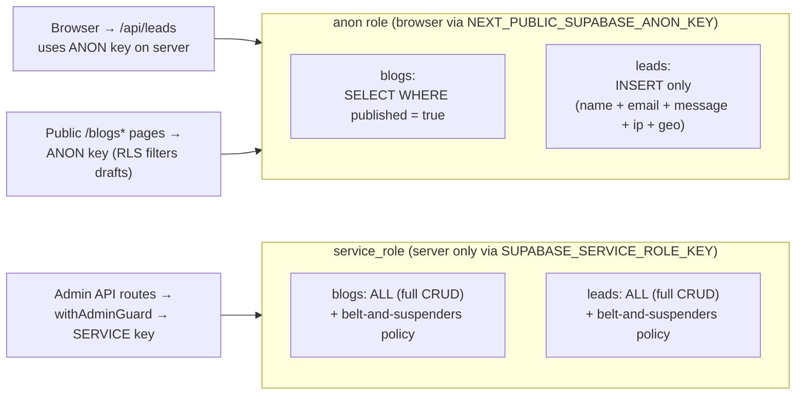

> Belt-and-suspenders: schema declares `alter table … no force row level security` AND explicit `"Service role full access"` policies. Dual safeguard against a dashboard "Force RLS" toggle silently zero-ing out admin UPDATE/DELETE.

---

## 6. API surface

| Method | Path | Auth | Purpose | Request body | Response |
|---|---|---|---|---|---|
| POST | `/api/leads` | public + rate-limit | Contact form submission | `{name, email, phone?, message}` | `200 {ok: true, id}` · `400` validation · `429` rate-limited |
| POST | `/api/admin/login` | public | Username/password sign-in | `{username, password}` | `200 {ok: true}` (sets HMAC cookie) · `401` |
| POST | `/api/admin/logout` | session | Destroys session cookie | — | `200 {ok: true}` |
| GET | `/api/admin/blogs` | session | List all blogs (incl. drafts) | — | `200 {blogs: Blog[]}` |
| POST | `/api/admin/blogs` | session + CSRF + rate | Create blog | `{title, slug, content, cover_image?, meta_description?, tags?, published}` | `201 {blog}` · `409` dup slug · `400` validation |
| GET | `/api/admin/blogs/[id]` | session | Get single blog | — | `200 {blog}` · `404` |
| PUT | `/api/admin/blogs/[id]` | session + CSRF + rate | Update blog + revalidate paths | same as POST | `200 {blog}` · `404` |
| DELETE | `/api/admin/blogs/[id]` | session + CSRF + rate | Delete blog + revalidate paths | — | `200 {ok, deleted}` · `404` |
| GET | `/api/admin/leads` | session | List all leads | — | `200 {leads: Lead[]}` |
| PATCH | `/api/admin/leads/[id]` | session + CSRF + rate | Toggle read | `{read: boolean}` | `200 {lead}` · `404` |
| DELETE | `/api/admin/leads/[id]` | session + CSRF + rate | Delete lead | — | `200 {ok}` · `404` |
| GET | `/api/admin/leads/export` | session | CSV download of all leads | — | `200 text/csv` with `Content-Disposition: attachment` |
| GET | `/api/admin/diagnostics` | session | End-to-end self-test (env + RLS + CRUD) | — | `200 {checks: Check[], halt}` |

Every admin route is wrapped in `withAdminGuard(handler, opts?)` from `lib/admin-handler.ts` — single boundary for CSRF, rate limit, session check, and JSON error response.

---

## 7. Request flows

### 7.1 Visitor submits the contact form

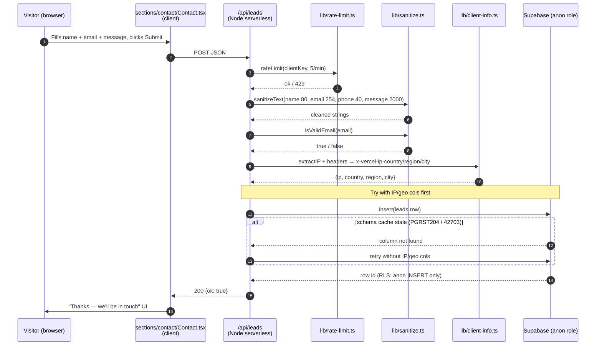

### 7.2 Admin login

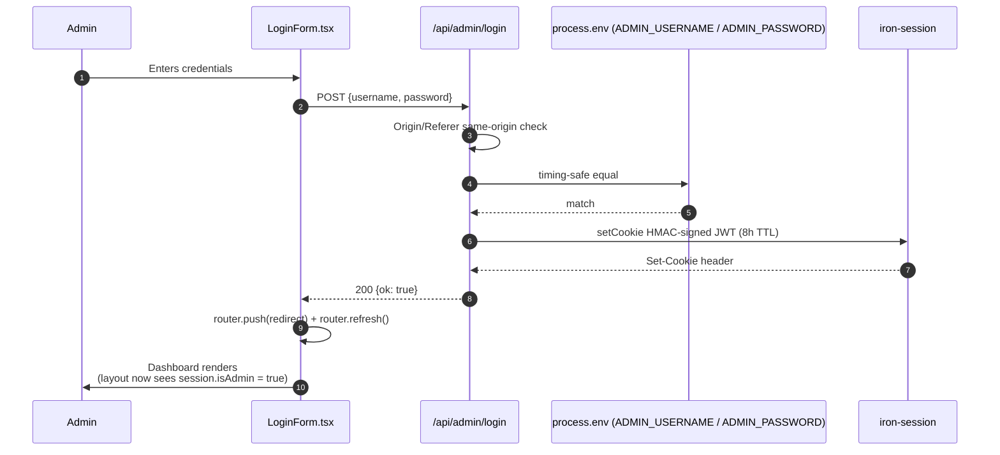

### 7.3 Admin creates a blog post

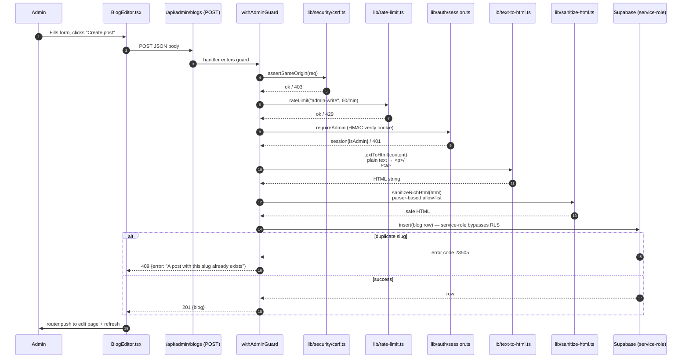

### 7.4 Visitor opens blog from listing (modal flow)

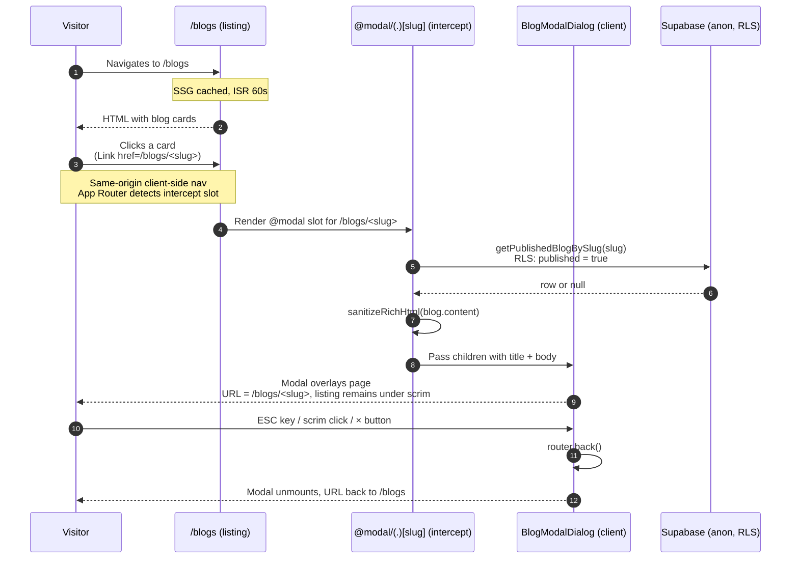

### 7.5 Visitor opens blog directly (SEO path)

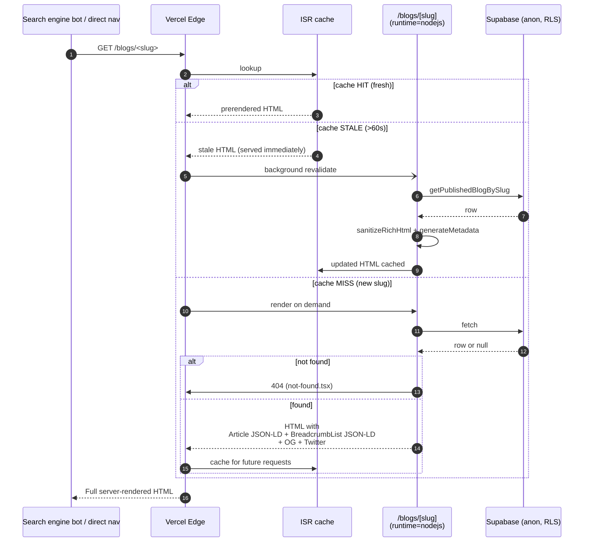

### 7.6 Diagnostics self-test

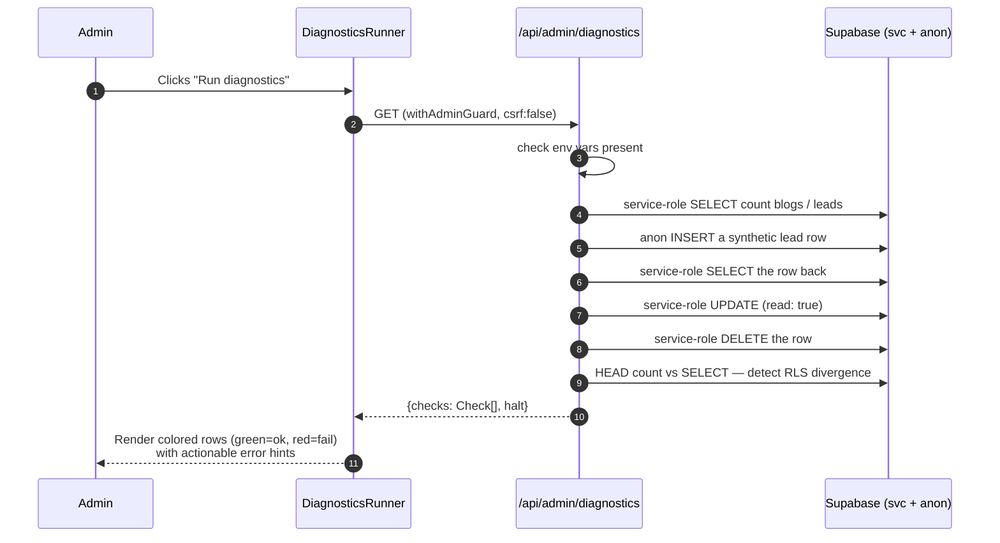

---

## 8. Authentication & security

Defense in depth, four layers. Each layer is a single source of truth — they don't duplicate logic.

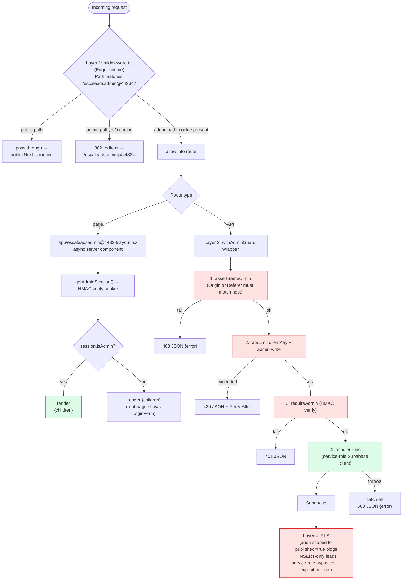

> **Why middleware doesn't validate the cookie**: middleware runs in Edge runtime which can't import `iron-session` (pulls Node `crypto`). The cookie's HMAC is verified inside Node-runtime route handlers via `getAdminSession()`. Forging a cookie name passes the middleware; forging a valid HMAC signature is what's actually hard.

---

## 9. Data fetching strategies

Which strategy serves which route, and why.

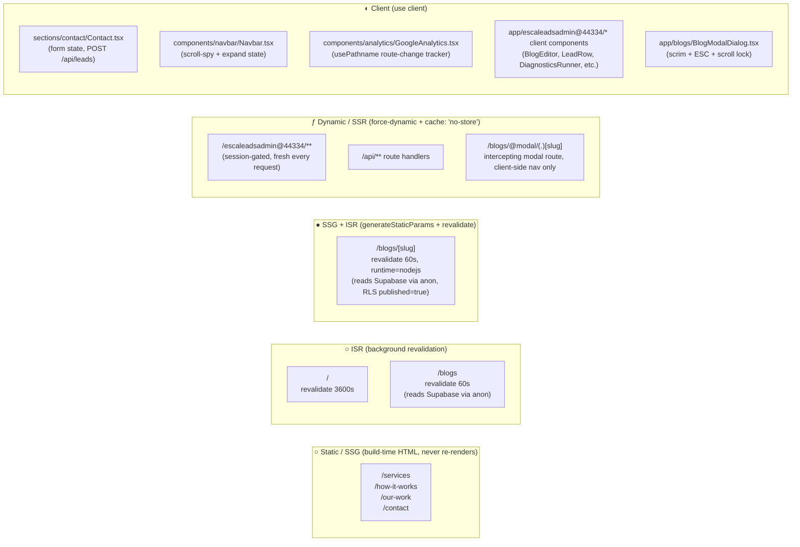

**Cache-busting rationale (CLAUDE.md §6.6 / §6.16):** server-side Supabase clients pass a custom `global.fetch` that always sets `cache: 'no-store'`. Admin pages additionally export `dynamic = 'force-dynamic'`. Both are required — neither alone defeats every layer of Next.js's caching.

---

## 10. Sanitization pipeline

Two-pass sanitation on write, second-pass defense on read. **No jsdom anywhere** (the previous DOMPurify chain crashed on Vercel cold-starts).

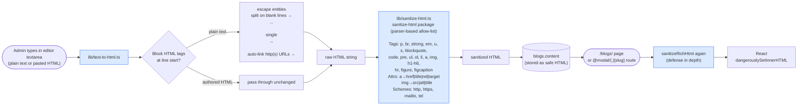

> The plain-text sanitizer `lib/sanitize.ts` is **deliberately separate** and has **NO** DOMPurify/sanitize-html import. Hot routes like `/api/leads` and `/api/admin/login` only need cheap regex stripping — pulling in the parser would inflate every cold-start.

---

## 11. Styling architecture

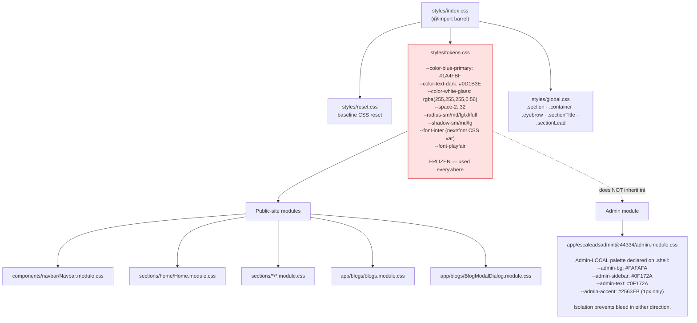

---

## 12. Build & deploy pipeline

```mermaid
sequenceDiagram
    autonumber
    participant Dev as Developer
    participant Local as Local checkout
    participant GH as GitHub (origin/main)
    participant Vercel as Vercel build
    participant Edge as Vercel Edge CDN
    participant Visitor

    Dev->>Local: code change
    Dev->>Local: npm run typecheck && npm run lint && npm run build
    Local-->>Dev: all green
    Dev->>Local: git commit
    Dev->>GH: git push origin HEAD:main
    GH-->>Vercel: webhook
    Vercel->>Vercel: npm ci → next build
    Note over Vercel: SSG pages prerendered (incl.<br/>generateStaticParams from Supabase)<br/>ISR cache initialized
    Vercel->>Edge: atomic deploy<br/>(serverless functions + static assets)
    Edge-->>Visitor: production URL live

    rect rgb(240, 250, 240)
    Note over Edge,Visitor: Subsequent requests
    Visitor->>Edge: GET /
    Edge-->>Visitor: SSG HTML from CDN (instant)
    Visitor->>Edge: GET /blogs/<slug>
    Edge-->>Visitor: ISR-cached HTML; background revalidate every 60s
    Visitor->>Edge: POST /api/leads
    Edge-->>Visitor: serverless function executes
    end
```

---

## 13. SEO audit findings

> Findings from the last audit pass on the live deploy. Severity by how much it blocks Google indexing.

### 🔴 Critical — blocks SEO indexing

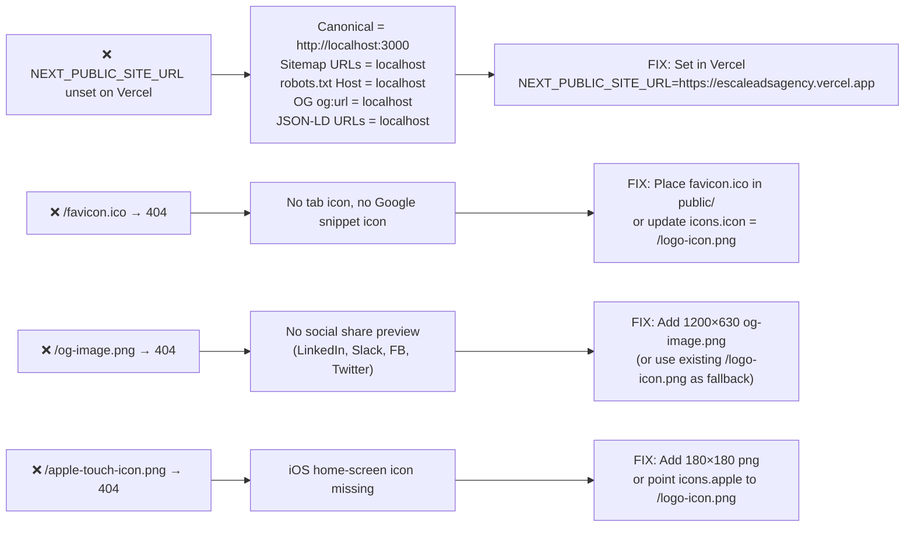

### 🟡 High — incomplete SEO

| # | Issue | Fix |
|---|---|---|
| 5 | Sitemap missing `/services`, `/how-it-works`, `/our-work`, `/contact` | Add to `app/sitemap.ts` |
| 6 | No `og:image` in `<head>` anywhere | Add `openGraph.images` to root `metadata` |
| 7 | Sub-pages don't override Twitter card → every page tweets the homepage title | Add `twitter` per-page metadata |
| 8 | `searchAction` in WebSite JSON-LD points to `/blogs?q=` which isn't implemented | Remove (or implement search) |
| 9 | `sameAs: []` empty in Organization JSON-LD | Remove or populate with real social URLs |
| 10 | `/services`, `/how-it-works`, `/our-work`, `/contact` have NO `<h1>` (section components use `<h2>` because the homepage hero owns the page h1) | Either add page-level `<h1>` wrapper to each route OR add `as` prop to sections |

### 🟢 Already good

- Article + BreadcrumbList JSON-LD on `/blogs/[slug]` ✓
- Organization + WebSite JSON-LD globally ✓
- Per-page `title` + `description` + `canonical` (mechanically correct, just localhost-poisoned) ✓
- Security headers (CSP, HSTS, X-Frame-Options, Referrer-Policy, Permissions-Policy) on every response ✓
- `robots.txt` disallows admin + `/api` ✓
- All rendered `<Image>` components have `alt` text ✓
- Mobile viewport, theme color, format-detection meta ✓
- GA4 with manual SPA pageview hook (admin paths skipped) ✓
- Modal route is **not** in the SEO surface (intercepting routes only fire on client-side nav) ✓
- `/blogs/[slug]` pinned to `runtime = 'nodejs'` so ISR renders don't fall through to Edge ✓
